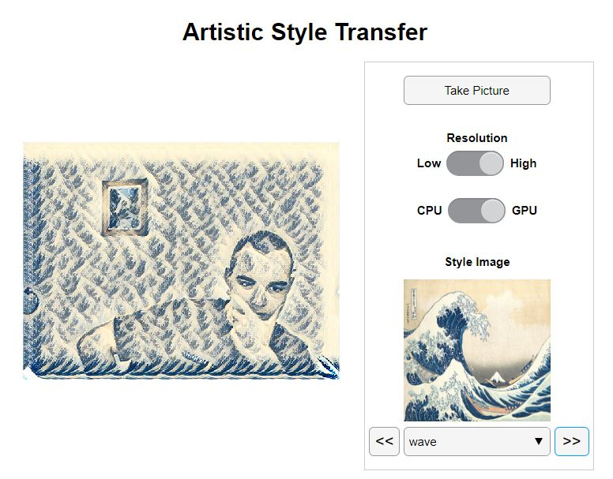
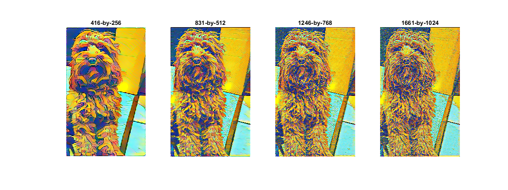

# Artistic Style Transfer with a Webcam

This repository contains an application which converts the input from your webcam to an artistic equivalent.
This is implemented using real-time style transfer described in the paper by 
[Johnson et al. *Perceptual Losses for Real-Time Style Transfer
and Super-Resolution*](https://arxiv.org/pdf/1603.08155.pdf). 
The neural networks, contained in the `networks` folder, were trained using the COCO dataset,
 which was collected by the COCO Consortium (cocodataset.org).

- [📦 Requirements](#requirements)
- [🏁 Getting Started](#getting-started)
- [🖼️ Usage](#usage)
- [❓ Resolution and Feature Size](#resolution-and-feature-size)
- [💬 Contribute](#contribute)

## Requirements

Make sure you have the minimum following requirements:

- [MATLAB R2020a or later](https://www.mathworks.com/products/get-matlab.html?s_tid=gn_getml)
- [Deep Learning Toolbox](https://www.mathworks.com/products/deep-learning.html)
- [MATLAB Support Package for USB Webcams](https://www.mathworks.com/matlabcentral/fileexchange/45182-matlab-support-package-for-usb-webcams)
- A webcam
- [A supported GPU](https://www.mathworks.com/help/parallel-computing/gpu-support-by-release.html) (optional for better performance)

Note that, once you have MATLAB installed, the easiest way to install toolboxes and support packages
 is the [Add-On Explorer](https://www.mathworks.com/help/matlab/matlab_env/get-add-ons.html). 

## Getting Started

1. Download or [clone](https://www.mathworks.com/help/matlab/matlab_prog/use-source-control-with-projects.html#mw_4cc18625-9e78-4586-9cc4-66e191ae1c2c)
 this repository to your machine.
2. Open the repository in MATLAB.
3. Connect a supported webcam if no built-in webcam is available.
4. Open the project file `ArtisticStyleTransfer.prj`. This action adds the necessary folders to the path and opens the project view.
5. Right click on the `ArtisticStyleTransfer.mlapp` file and choose **Run**.

## Usage

When you open the app, the pretrained networks in the `networks` folder are loaded. This operation takes a few seconds to complete.
Once loading is completed, you should see something similar to the image below.

From this view, you can:

1. Change the applied style using the dropdown menu or the left and right arrows.
2. Take a picture. The images are saved in a folder called `pictures`. This folder is created in your current working directory.
3. Choose whether to use the CPU or the GPU for the image processing. If a GPU is not available, this option is disabled.
4. Choose a resolution. Note that a low resolution results in less image processing and a more responsive app.

## Resolution and Feature Size

If you change the resolution, then you can notice that the size of the features also changes. 
This is because the pre-trained networks have learned features of a predefined size in terms of pixels. 
When you reduce the resolution, you are effectively giving a smaller image to the network. 
The app resizes the image to fill the screen. 
Therefore, if you set the resolution to low, the features appear larger within the image, even though the features are of the same size in terms of pixels. 
This is demonstrated in the image below.

## Contribute

Please file any bug reports or feature requests as [GitHub issues](https://github.com/matlab-deep-learning/artistic-style-transfer/issues).
 
_Copyright 2020 The MathWorks, Inc._
